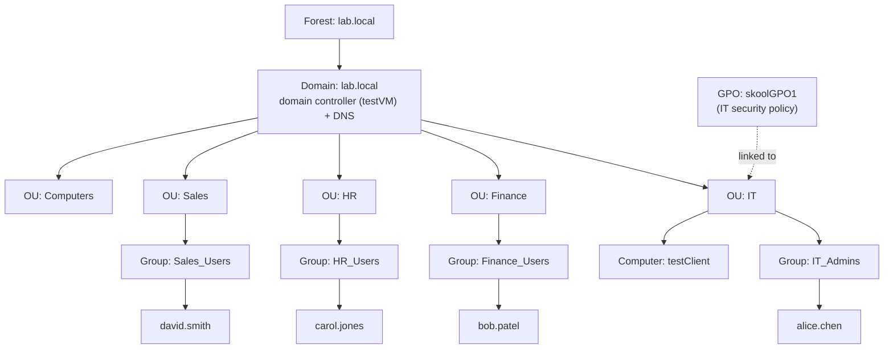
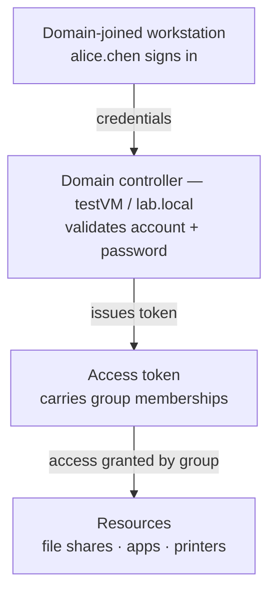
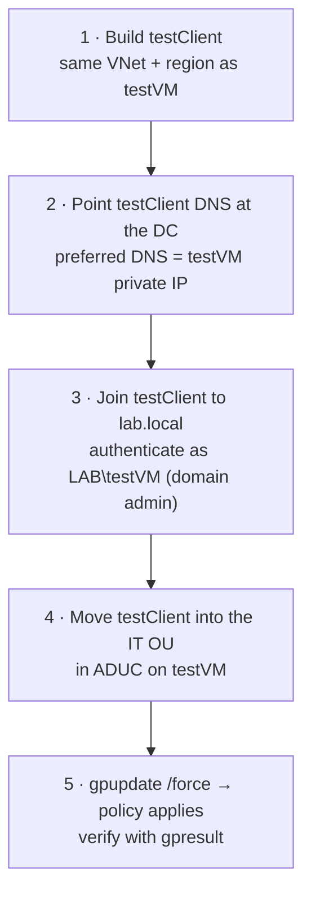

# Lab 1 — Build & Manage an Active Directory Domain


-1D9E75)

A hands-on lab that stands up a Windows Server 2025 domain controller, builds a complete Active Directory (AD) structure — organizational units, security groups, users, and Group Policy — joins a separate client machine to the domain, and verifies that policy is enforced on that client end to end. The goal isn't just a working domain; it's being able to explain **who is allowed to do what, how that decision is made, and proving the controls actually apply.**

> **Environment as built:** domain controller `testVM`, client `testClient`, domain `lab.local` (NetBIOS `LAB`), in Azure region North Central US. The Group Policy Object is named `skoolGPO1` and functions as the IT security policy.

---

## Why this matters

Almost every organization running Windows relies on Active Directory to answer one question: *who can access what?* AD controls which users log into which machines, which groups reach which resources, and which policies apply where. Onboard someone by creating one account and adding it to the right groups; offboard them by disabling that single account, and every door closes simultaneously.

This is not legacy knowledge. Hybrid environments run AD on-premises and sync identities into **Microsoft Entra ID** (formerly Azure AD), and the cloud model reuses the same primitives — users, groups, roles, conditional access. AD is also the single most targeted system in ransomware campaigns, so understanding how it's built is the foundation for defending it.

| Role | How this lab applies |
|------|----------------------|
| IT Support / Help Desk | Password resets, account unlocks, and group changes — the top ticket types anywhere |
| Sysadmin | OU design, GPO deployment, managing domain-joined machines at scale |
| Cloud Engineer | Entra ID reuses these exact concepts — on-prem AD knowledge transfers directly |
| Security Analyst | AD is the #1 ransomware target; knowing how it works is the basis for defending it |

---

## Architecture

### Directory hierarchy

The forest is the top-level container; the domain is the management boundary; OUs are the folders you organize people and machines into and link policy to. Every OU holds a security group, and users live in the group — so access is always granted by role, never per person.



### What happens at logon

This is the access decision in motion. A user signs in, the domain controller validates them against AD, and an access token carrying their group memberships determines what they can reach.



---

## Environment & cost

| Item | Value | Notes |
|------|-------|-------|
| Guest OS | Windows Server 2025 Datacenter (Gen2) | Free 180-day evaluation license |
| Host | Azure VM, size `Standard_B2s` (2 vCPU, 4 GB RAM) | Smallest size that runs AD comfortably |
| Region | North Central US | Both VMs deployed here, on the same VNet |
| Disk | Standard SSD | Included in free-tier storage |
| Cost | $0 | Covered by the Azure for Students account and evaluation licensing |

> **Stop both VMs between sessions.** A `B2s` VM costs roughly $0.05/hour while running. *Stopping* (deallocating) — not deleting — pauses compute billing and stretches your free credit across the multi-session lab.

---

## Step 1 — Provision the domain controller VM (testVM)

In the Azure portal, **Virtual machines → Create**, using:

| Setting | Value |
|---------|-------|
| Image | Windows Server 2025 Datacenter — Gen2 |
| Size | `Standard_B2s` |
| Authentication | Password (set a strong one) |
| Public inbound ports | Allow **RDP (3389)** |
| OS disk | Standard SSD |

A single VM deployment creates five resources — the VM, its network interface, a virtual network, a public IP, and a network security group — all in one resource group.


Review + Create, then Create. When it finishes, RDP into the VM — all remaining build steps happen *inside* the server.

---

## Step 2 — Install Active Directory Domain Services

Server Manager opens automatically on login.

**GUI:** Server Manager → **Manage → Add Roles and Features**. Click through to **Server Roles**, check **Active Directory Domain Services**, accept **Add Features** for the management tools, then finish and **Install**. Do *not* restart yet.

**PowerShell:**

```powershell
# Install the AD DS role and its management tools
Install-WindowsFeature -Name AD-Domain-Services -IncludeManagementTools
```

Install the Group Policy Management Console now too — Step 5 needs it, and it's a separate tool from Active Directory Users and Computers:

```powershell
Install-WindowsFeature -Name GPMC
# Then close and reopen Server Manager so "Group Policy Management" appears under Tools
```

> A **Domain Controller (DC)** is the server that runs Active Directory — the authority every logon is checked against. Installing the *role* doesn't create a domain; promotion (next step) does.

---

## Step 3 — Promote the server to a Domain Controller

Promotion creates your **forest**, your **domain**, and makes this server the authoritative DNS and identity source for everything that joins.

**GUI:** Click the yellow notification flag → **Promote this server to a domain controller** → **Add a new forest** → root domain name `lab.local`. Set a **Directory Services Restore Mode (DSRM)** password (record it — it's for disaster recovery only). Accept the DNS and NetBIOS defaults → **Install**. The server reboots automatically.

**PowerShell:**

```powershell
Import-Module ADDSDeployment
Install-ADDSForest -DomainName 'lab.local' -DomainNetBiosName 'LAB' `
  -InstallDns:$true `
  -SafeModeAdministratorPassword (ConvertTo-SecureString 'YourDSRMPassword!' -AsPlainText -Force) `
  -Force:$true
```

> A **forest** is the top-level container for your whole AD structure; a **domain** is a managed boundary inside it (`lab.local`). Most small-to-mid organizations run one domain in one forest.

---

## Step 4 — Build the structure: OUs, groups, and users

Open **Active Directory Users and Computers (ADUC)** from the Tools menu.

### Organizational Units

OUs are AD's folders — and crucially, you can link Group Policy to an OU so every object inside inherits it.

```powershell
New-ADOrganizationalUnit -Name "IT"        -Path "DC=lab,DC=local"
New-ADOrganizationalUnit -Name "Finance"   -Path "DC=lab,DC=local"
New-ADOrganizationalUnit -Name "HR"        -Path "DC=lab,DC=local"
New-ADOrganizationalUnit -Name "Sales"     -Path "DC=lab,DC=local"
New-ADOrganizationalUnit -Name "Computers" -Path "DC=lab,DC=local"
```

### Security groups

A security group holds user accounts. You grant access to the *group*, then add users to it — this is role-based access control (RBAC). Give 50 Finance staff access to a new system by adding one `Finance_Users` group, not 50 users. Someone joins Finance, you add them and they inherit everything; someone leaves, you remove them and all access is revoked at once.

```powershell
New-ADGroup -Name "IT_Admins"     -GroupScope Global -GroupCategory Security -Path "OU=IT,DC=lab,DC=local"
New-ADGroup -Name "Finance_Users" -GroupScope Global -GroupCategory Security -Path "OU=Finance,DC=lab,DC=local"
New-ADGroup -Name "HR_Users"      -GroupScope Global -GroupCategory Security -Path "OU=HR,DC=lab,DC=local"
New-ADGroup -Name "Sales_Users"   -GroupScope Global -GroupCategory Security -Path "OU=Sales,DC=lab,DC=local"
```

### Users

A user account is the single identity that controls everything that person can reach, based on its group memberships. Use a consistent convention (`firstname.lastname`).

```powershell
# Run this entire block together — $password must be defined before New-ADUser runs,
# or PowerShell will prompt for a Name and the script will fail.

$password = ConvertTo-SecureString "Welcome@2026!" -AsPlainText -Force

New-ADUser -Name "alice.chen"  -GivenName "Alice" -Surname "Chen"  -SamAccountName "alice.chen"  -UserPrincipalName "alice.chen@lab.local"  -Path "OU=IT,DC=lab,DC=local"      -AccountPassword $password -Enabled $true
New-ADUser -Name "bob.patel"   -GivenName "Bob"   -Surname "Patel" -SamAccountName "bob.patel"   -UserPrincipalName "bob.patel@lab.local"   -Path "OU=Finance,DC=lab,DC=local" -AccountPassword $password -Enabled $true
New-ADUser -Name "carol.jones" -GivenName "Carol" -Surname "Jones" -SamAccountName "carol.jones" -UserPrincipalName "carol.jones@lab.local" -Path "OU=HR,DC=lab,DC=local"      -AccountPassword $password -Enabled $true
New-ADUser -Name "david.smith" -GivenName "David" -Surname "Smith" -SamAccountName "david.smith" -UserPrincipalName "david.smith@lab.local" -Path "OU=Sales,DC=lab,DC=local"   -AccountPassword $password -Enabled $true

Add-ADGroupMember -Identity "IT_Admins"     -Members "alice.chen"
Add-ADGroupMember -Identity "Finance_Users" -Members "bob.patel"
Add-ADGroupMember -Identity "HR_Users"      -Members "carol.jones"
Add-ADGroupMember -Identity "Sales_Users"   -Members "david.smith"
```

The IT OU below shows the result: the `alice.chen` user, the `IT_Admins` security group, and (after the domain join in Step 6) the `testClient` computer — all governed together by the OU's linked policy.


> The default password here is for a throwaway lab only. In any real environment, force a change at first logon and never reuse a shared password across accounts.

---

## Step 5 — Configure Group Policy

A **Group Policy Object (GPO)** is a set of rules Windows enforces automatically on every user or computer in an OU — create once, link to an OU, and it applies on next logon or `gpupdate`. Open **Group Policy Management** from Tools.

Expand **Forest: lab.local → Domains → lab.local**, right-click the **IT** OU → **Create a GPO in this domain and link it here**, name it `skoolGPO1` (this is the IT security policy), then **Edit** and set:

| Policy path | Setting | Value | Why |
|-------------|---------|-------|-----|
| Computer Config → Windows Settings → Security → Account Policies → Password Policy | Minimum password length | `12` | Enforces strong passwords |
| (same path) | Password must meet complexity requirements | `Enabled` | Requires upper, lower, number, symbol |
| Computer Config → Windows Settings → Security → Local Policies → Security Options | Interactive logon: machine inactivity limit | `900` seconds | Auto-locks the screen after 15 minutes |
| Computer Config → Administrative Templates → System → Removable Storage Access | All removable storage classes: Deny all access | `Enabled` | Blocks data exfiltration via USB |

The GPO's Settings tab confirms all four controls are defined and enabled:


---

## Step 6 — Join a client to the domain and verify policy

Configuring a policy proves you can *write* a control. Joining a real machine and confirming the policy lands proves the control actually *enforces* — the part that matters. This step stands up a second VM (`testClient`), joins it to `lab.local`, places it in the IT OU, and verifies `skoolGPO1` applies.

### The join, conceptually



> **Why the DNS step matters:** a client finds a domain by asking a DNS server where `lab.local` lives. The domain controller *is* that DNS server, so `testClient` must use `testVM`'s private IP for DNS — otherwise the join fails with "domain could not be contacted." Set the VNet's DNS servers to the DC's private IP and reboot the client.

### The steps

1. **Build `testClient`** in the same resource group, region (North Central US), and **virtual network** as `testVM`.
2. **Point DNS at the DC:** set `testVM`'s private IP to **Static**, then set the VNet's **DNS servers** to that IP. Reboot `testClient`.
3. **Join the domain:** on `testClient`, run `sysdm.cpl` → **Change** → **Domain** → `lab.local`, authenticating as the domain admin (`LAB\testVM`). Restart.
4. **Move the computer into the IT OU:** on `testVM`, in ADUC, move `TESTCLIENT` from the default Computers container into the **IT** OU — so the OU's policy applies to it.
5. **Apply and verify:** on `testClient`, run `gpupdate /force`, then `gpresult /r`.

### Verification

Running `gpresult /r` on `testClient` confirms the policy was pulled from the domain controller and `skoolGPO1` applied at the computer level:


This confirms the full lifecycle end to end: a policy authored on the domain controller, linked to an OU, and enforced on a separate domain-joined machine — exactly how access and security baselines propagate across an enterprise.

> **Note on Remote Desktop access:** by default, only administrators can RDP into a domain-joined machine. To log in as a standard domain user such as `alice.chen`, add the user to the **Remote Desktop Users** group on `testClient` (`sysdm.cpl` → Remote → Select Users). This is itself a least-privilege lesson — remote access is a right you grant deliberately, not a default.

---

## Step 7 — Help desk runbook

The day-one tasks every support and identity role expects.

**Reset a password** (always force a change at next logon):

```powershell
Set-ADAccountPassword -Identity "bob.patel" -Reset -NewPassword (ConvertTo-SecureString "NewPass@2026!" -AsPlainText -Force)
Set-ADUser -Identity "bob.patel" -ChangePasswordAtLogon $true
```

**Unlock an account** (locks happen after too many failed attempts):

```powershell
Unlock-ADAccount -Identity "carol.jones"
```

**Offboard an employee** — disable, don't delete (preserves history and memberships for audit):

```powershell
Disable-ADAccount -Identity "david.smith"
Search-ADAccount -AccountDisabled | Select-Object Name, SamAccountName
```

**Audit & reporting** for security/compliance:

```powershell
# Accounts with no logon in 90+ days
$cutoff = (Get-Date).AddDays(-90)
Get-ADUser -Filter {LastLogonDate -lt $cutoff -and Enabled -eq $true} -Properties LastLogonDate | Select-Object Name, LastLogonDate

# A specific user's group memberships
Get-ADPrincipalGroupMembership -Identity "alice.chen" | Select-Object Name
```

---

## Verification reference

| Check | Command | Expected result |
|-------|---------|-----------------|
| DC is running | `Get-ADDomainController` | Returns DC info, forest `lab.local` |
| OUs exist | `Get-ADOrganizationalUnit -Filter *` | Lists the OUs |
| Users enabled | `Get-ADUser -Filter {Enabled -eq $true}` | Lists the test accounts |
| Memberships correct | `Get-ADGroupMember -Identity IT_Admins` | Returns `alice.chen` |
| GPO linked | `Get-GPInheritance -Target 'OU=IT,DC=lab,DC=local'` | Shows `skoolGPO1` linked |
| Policy applied to client | `gpresult /r` on `testClient` | `skoolGPO1` under Applied Group Policy Objects |

---

## Security notes

Active Directory is the most attacked system in enterprise ransomware, so the build choices here are security choices:

- **Group-based access is least privilege in practice.** Users get only what their role's group grants. Access reviews and offboarding become one action against one object instead of hunting per-resource grants.
- **Offboarding = disable, not delete.** Disabling severs access immediately while preserving the account for audit and investigation; deletion destroys evidence.
- **The GPO enforces a baseline everywhere at once** — password length and complexity, a screen-lock timer, and USB storage blocking to cut a common data-exfiltration path. Verified applying to a real client, not just configured.
- **Remote access is a granted right.** Standard users can't RDP into a domain-joined machine until explicitly added — a practical least-privilege control.
- **Guard the high-value secrets.** The DSRM password and Domain Admin credentials are crown jewels. In a real environment, protect privileged access with MFA and just-in-time elevation rather than standing admin rights, and follow a tiered-administration model.
- **The Windows Event Log is your detection source.** Failed logons, account lockouts, and group changes recorded on the DC are exactly what a SIEM (e.g. Microsoft Sentinel) ingests to detect attacks against the directory.

---

## Troubleshooting

| Problem | Fix |
|---------|-----|
| PowerShell prompts for `Name:` when creating users | The `New-ADUser` commands ran before `$password` was defined — run the whole Step 4 block together |
| Domain join fails: "domain could not be contacted" | DNS not pointing at the DC — set the VNet DNS to `testVM`'s private IP and restart `testClient` |
| `testVM-vnet` not available when building `testClient` | The client must be in the same region/VNet as the DC — build it in North Central US |
| User "not authorized for remote" login | Standard users can't RDP by default — add them to Remote Desktop Users on `testClient` |
| GPO not in `gpresult /r` | Confirm `TESTCLIENT` is inside the IT OU, then run `gpupdate /force` again |
| `rsop.msc` shows "Access Denied" as a standard user | Expected — standard users can't read computer policy via RSoP; use `gpresult /r` instead |

---

## Key concepts glossary

| Term | Plain-English meaning |
|------|----------------------|
| **Forest** | The top-level container for an entire AD deployment |
| **Domain** | A managed boundary inside a forest (`lab.local`) |
| **Domain Controller (DC)** | The server running AD that authenticates logons (`testVM`) |
| **Organizational Unit (OU)** | A folder for organizing objects and linking policy |
| **Security group** | A container of users you grant access to as a unit (RBAC) |
| **User account** | A single identity whose access derives from group membership |
| **Group Policy Object (GPO)** | Centrally enforced settings applied to an OU's objects (`skoolGPO1`) |
| **Domain join** | Connecting a machine so the domain manages and authenticates it |
| **DSRM password** | Directory Services Restore Mode credential for DC recovery |
| **Entra ID** | Microsoft's cloud identity service that AD concepts map onto |

---

## What I learned

- Promotion — not role installation — is what creates a forest, domain, and authoritative DNS/identity server.
- Access in an enterprise is granted to groups, not individuals; this is what makes onboarding and offboarding scale and stay auditable.
- A single GPO enforces a security baseline across every machine in an OU — and I verified it applying to a real domain-joined client, not just on paper.
- Domain join depends on DNS resolution to the domain controller; getting that wrong is the most common failure.
- The same primitives — users, groups, OUs, policy — carry directly into cloud identity with Entra ID.

## Next steps

- Build the equivalent users and groups in **Microsoft Entra ID** and configure hybrid sync to see the on-prem-to-cloud bridge
- Forward DC security events to a Log Analytics workspace and write detection queries in Microsoft Sentinel
- Add a tiered-admin model and just-in-time privileged access

---

*Part of a hands-on cloud and security lab portfolio. Background spans IT general controls (ITGC) auditing, enterprise access administration, and SQL-based reporting — applied here to building and securing identity infrastructure from the ground up.*
