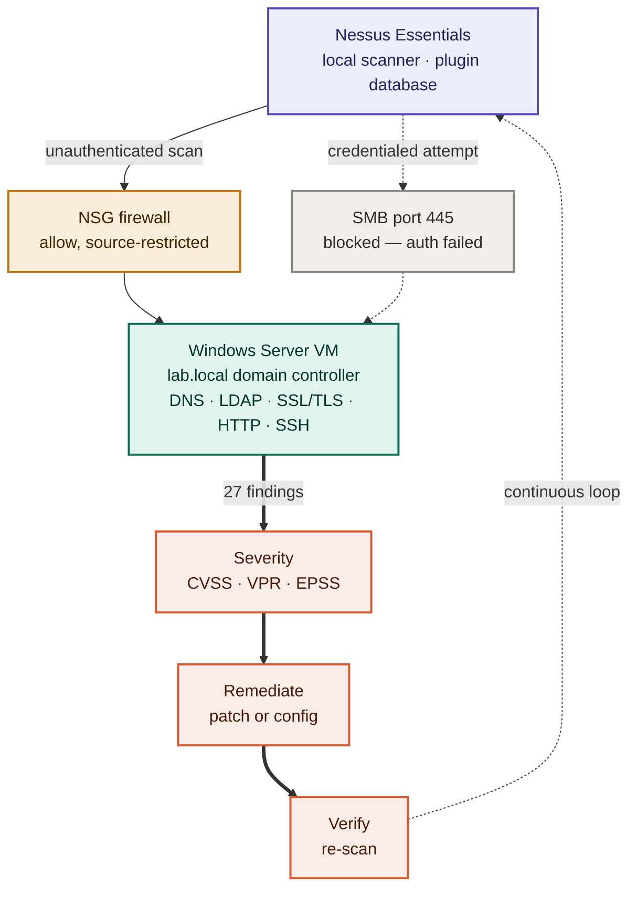

# Lab 5 — Nessus Vulnerability Scanning

-1D9E75)

## Overview

In this lab I used **Nessus Essentials** — the free tier of the most widely deployed vulnerability scanner in the world — to scan a live target and interpret what it found. Working through the lab, I:

1. **Deployed and activated the scanner**, including the plugin database that holds its vulnerability checks.
2. **Ran an unauthenticated network scan** against my Lab 1 Windows Server **VM (Virtual Machine)** in Azure, discovering its exposed services.
3. **Interpreted the findings by severity**, reading **CVSS (Common Vulnerability Scoring System)** scores and remediation guidance.
4. **Diagnosed a failed credentialed scan** using the scanner's own audit trail — isolating a connectivity failure from a credentials failure.

The goal wasn't just to run a scan — it was to work the loop a vulnerability programme actually runs: **scan → find → prioritise → remediate → verify**, and to be able to explain what a finding means and how urgent it is.

> **What this proves:** I can deploy a vulnerability scanner, get it reaching a cloud target through a firewall, read findings by severity and CVSS score, explain what a specific vulnerability means and how to fix it, and diagnose a scan failure from the tool's own diagnostics rather than by guesswork.

---

## Why this matters

Every network has vulnerabilities. The question is never whether they exist — it's whether the organisation finds them before an attacker does. Vulnerability management is the systematic process of finding, classifying, prioritising, and remediating weaknesses on a continuous cycle. Nessus is the tool most security teams use to run it: regular scans across the estate, reports for management and compliance, and tracking whether remediation is actually reducing risk over time.

| Role | How this lab applies |
|------|----------------------|
| Vulnerability Analyst | Running scans, triaging findings, and tracking remediation is the core of the role |
| Security Engineer | Understanding severity, CVSS scoring, and remediation priority to guide infrastructure decisions |
| SOC (Security Operations Center) Analyst | Vulnerability data informs investigation priority — a host with known weaknesses is higher risk when it appears in an alert |
| Cloud Security Engineer | Cloud-native scanners (Microsoft Defender for Cloud, AWS Inspector) work on the same concepts; Nessus builds the foundation |
| IAM (Identity and Access Management) Analyst | Scans surface weak and default credentials and access-related misconfigurations — and credentialed scanning is itself an exercise in least-privilege service accounts |

---

## Architecture — how the scan reaches its target

This diagram traces the actual path a scan took in this lab: the scanner on my local machine, out across the internet, through Azure's firewall, to the domain controller — then back through severity scoring into the remediation loop. The two gates in the middle are the whole story of why the first scan returned nothing: the **NSG (Network Security Group)** controls whether scan traffic arrives at all, and **SMB (Server Message Block)** on port 445 controls whether the scanner can log in for the deeper credentialed inspection.

---

## Setup & environment

- **Scanner:** Nessus Essentials, installed locally on Windows and reached at `https://localhost:8834`. Free tier — 5 IP addresses, permanently free, activation code by email from tenable.com.
- **Target:** the Windows Server **VM (Virtual Machine)** from my [Active Directory lab](../active-directory/) — the `lab.local` domain controller — running in Microsoft Azure.
- **Path between them:** because the scanner runs locally and the target is in Azure, the scan crosses the public internet and passes through the target's **NSG (Network Security Group)**. Inbound rules were added source-restricted to my own public IP address only.
- **First run note:** Nessus downloads its plugin database on first launch, which takes 10–20 minutes before any scan can run.

> Only systems I own were scanned. Vulnerability scans generate significant traffic and look identical to an attack probe to any monitoring system in the path — scanning anything without ownership or written permission is not acceptable.

---

## Key concepts (quick reference)

- **Vulnerability management** — the continuous loop of finding, classifying, prioritising, remediating, and verifying security weaknesses.
- **Plugin** — an individual vulnerability check in Nessus's database; the plugin download is what makes the scanner useful.
- **Unauthenticated scan** — scanning from the outside with no login. Shows what an external attacker can see.
- **Credentialed scan** — the scanner logs into the target and inspects from the inside, finding missing patches and local misconfigurations. Typically returns 5–10× more findings, and is the enterprise standard for internal scanning.
- **CVSS (Common Vulnerability Scoring System)** — the universal 0–10 severity score. Critical 9.0–10.0 · High 7.0–8.9 · Medium 4.0–6.9 · Low 0.1–3.9 · Info 0.
- **VPR (Vulnerability Priority Rating)** and **EPSS (Exploit Prediction Scoring System)** — newer scores that factor in real-world threat activity and the likelihood of actual exploitation, rather than theoretical severity alone.
- **SMB (Server Message Block)** — the Windows file-sharing protocol on port 445; required for a credentialed Windows scan.

---

## Build 1 — Deploy and activate the scanner

**What I did:** registered for a free Nessus Essentials activation code, installed the scanner on my local Windows machine, reached the console at `https://localhost:8834`, activated it, created the scanner admin account, and waited for the plugin database to download.

**What it shows:** a working scanner with its full vulnerability-check database, ready to scan up to 5 IP addresses at no cost.

**What I learned:** the browser throws a certificate warning on first connection because Nessus serves its console over HTTPS using a **self-signed certificate** — one it generated itself rather than one issued by a trusted authority. Proceeding is safe here specifically because the connection is my own machine to itself. That same self-signed-certificate concept came back later as an actual finding on the scan target.

---

## Build 2 — Run a network scan against a live target

**What I did:** created a Basic Network Scan named `Lab Network Discovery`, pointed it at the Azure Windows Server VM, and launched it.

**What it shows:** the scan completed in 13 minutes and returned **1 host with 27 findings** — 3 Medium and the remainder Info. The Info findings are service and port detections rather than vulnerabilities: **SSL/TLS**, **HTTP**, **SSH**, **DNS (Domain Name System)**, and **LDAP (Lightweight Directory Access Protocol)**.

**What I learned:** the detected services are a direct read on what the machine *is*. **DNS** and **LDAP (Lightweight Directory Access Protocol)** appear because this target is a **domain controller** — those are the name and directory services Active Directory runs on, and LDAP is the protocol used to query the directory for users and groups. Seeing identity infrastructure show up on a vulnerability scan connects this lab straight back to Lab 1.

**Troubleshooting note — the private IP returned zero hosts:** the first scan targeted the VM's private IP (`10.0.0.4`) as written in the lab guide, finished in seconds, and found **0 hosts**. A private Azure IP address only exists inside Azure's virtual network — a scanner on the public internet has no route to it at all. Re-targeting the scan at the VM's **public** IP found the host immediately. A second gate then had to open: Azure's **NSG (Network Security Group)** blocks inbound traffic by default, so an inbound Allow rule was added with **Source restricted to my own public IP address** rather than `Any`. *Scanner placement determines which address space is reachable — a scanner deployed inside the virtual network would use private IPs and need no firewall exception at all.*

---

## Build 3 — Interpret the findings

**What I did:** sorted findings by severity, opened the Medium-severity results, and read each one's description, solution, and score.

**What it shows:** the two Medium findings were:
- **SSL Certificate Cannot Be Trusted** — **CVSS (Common Vulnerability Scoring System)** 6.5. The server's X.509 certificate is self-signed rather than issued by a recognised certificate authority, so a client cannot verify the server is genuinely who it claims to be. That broken chain of trust is what makes man-in-the-middle attacks easier. **Solution:** obtain or generate a properly issued certificate.
- **DNS Server Recursive Query Cache Poisoning Weakness** — CVSS 5.0, **VPR (Vulnerability Priority Rating)** 4.2, **EPSS (Exploit Prediction Scoring System)** 0.0132.

**What I learned:** every finding follows the same anatomy — synopsis, description, solution, **CVE (Common Vulnerabilities and Exposures)** identifier, CVSS score, risk factor, and the plugin output that is the actual evidence. And severity alone is not priority: the DNS finding scored CVSS 5.0 but carried an EPSS of just 0.0132, meaning real-world exploitation is unlikely. Practical prioritisation weighs **exploitability**, **asset criticality**, and **exposure** — a Critical on a domain controller outranks a Critical on a disposable test machine.

---

## Build 4 — Diagnose a failed credentialed scan

**What I did:** configured a second scan with Windows credentials to authenticate into the target, and when it reported **Auth: Fail** with only 2 findings, used the scanner's **Audit Trail** to find out why rather than guessing at settings.

**What it shows:** searching the Audit Trail for plugin ID **10394** — the SMB login check — returned:

> `smb_login.nasl was not launched: because the key 'SMB/name' is missing`

That single line reframed the whole problem. Nessus had never *attempted* the login: it couldn't reach **SMB (Server Message Block)** on port 445 at all. This was a **connectivity failure, not a credentials failure** — two problems with completely different fixes.

**What I did about it:** opened port 445 in the **NSG (Network Security Group)**, source-restricted to my own IP; added a matching inbound rule to the Windows Firewall on the VM itself; and set the Remote Registry service to Automatic and started it. Authentication still failed, and the credentialed scan remains unresolved in this lab.

**What I learned:** the most valuable thing here was the diagnostic method. Reading the tool's own audit output separated "cannot connect" from "wrong password" in one step — chasing credentials would have burned hours on the wrong problem. A related lesson: the lab guide specifies the username `Administrator`, but this VM's actual admin account is `testVM`, with the NetBIOS domain confirmed as `LAB` via `$env:USERDOMAIN`. Documented values are assumptions worth verifying. The deeper takeaway is architectural — a local scanner reaching a cloud target across the internet is an awkward topology by design, and it's exactly why production scanners are deployed *inside* the network, where SMB never crosses a public boundary.

---

## Lab setup vs. production

My configuration is a deliberate home-lab workaround, and knowing why matters more than the workaround itself:

| This lab | Production |
|---|---|
| Scanner on a local PC, target in Azure | Scanner deployed **inside** the virtual network |
| Public IP as the scan target | Private IPs only — scan traffic never crosses the internet |
| Port 445 opened through the NSG (Network Security Group) | SMB (Server Message Block) never exposed to the internet — it's a classic attack vector (WannaCry, EternalBlue) |
| Firewall exceptions added for the scan | Exceptions removed once the work is complete |

The principle underneath: **default deny, open only what's needed, restrict by source, and remove it when finished.**

---

## Summary — what this lab accomplished

| Build | What I demonstrated |
|-------|---------------------|
| Deploy the scanner | Installed, activated, and initialised Nessus Essentials with its full plugin database |
| Network scan | Got a scan reaching a live cloud target through a firewall, returning 27 findings on 1 host |
| Interpret findings | Read severity, CVSS, VPR and EPSS; explained a specific vulnerability and its remediation |
| Diagnose a failure | Used the Audit Trail to isolate a connectivity failure from a credentials failure |

**Skills demonstrated:** deploying and activating a vulnerability scanner; configuring scan targets and credentials; troubleshooting cloud network reachability through **NSG (Network Security Group)** rules with source restriction; reading and prioritising findings by **CVSS (Common Vulnerability Scoring System)**, **VPR (Vulnerability Priority Rating)** and **EPSS (Exploit Prediction Scoring System)**; explaining a certificate-trust vulnerability and its fix; and diagnosing an authentication failure from tool diagnostics rather than trial and error.

**What I took away overall:**
- Severity is not the same as priority — exploitability, asset criticality, and exposure decide what gets fixed first.
- Scanner placement is an architectural decision: it determines what's reachable and how much firewall exception is required.
- Reading a tool's own diagnostics is faster than changing settings hopefully. `SMB/name is missing` answered in one line what guesswork would have taken hours to reach.
- Documented lab values are assumptions. Verify the account name, the domain, and the IP against the real environment.
- Free tiers have ceilings — PDF reporting is paywalled in Nessus Essentials, so evidence was captured directly from the results views.

---

## How this connects to my other work

This lab looks at the same host from a different angle than the rest of my portfolio. My [Active Directory lab](../active-directory/) built this machine as an identity system — a domain controller answering "who can access what." Here I scanned that same machine from the outside to ask "what about it could be exploited," and the answer came back partly in identity terms: the exposed services Nessus enumerated were **DNS** and **LDAP (Lightweight Directory Access Protocol)** — the directory services identity runs on. My [Wireshark lab](../wireshark/) read traffic on the wire, my [Splunk lab](../splunk/) detected misuse in the logs, and my [ServiceNow lab](../servicenow/) governed how access is requested and approved. This one covers the vulnerability surface underneath all of it: identity controls sit on top of infrastructure, and unpatched infrastructure undermines them. Vulnerability data is also directly relevant to an **IAM (Identity and Access Management)** function — scans surface weak and default credentials, and the credentialed scanning account is itself a live exercise in least privilege.
