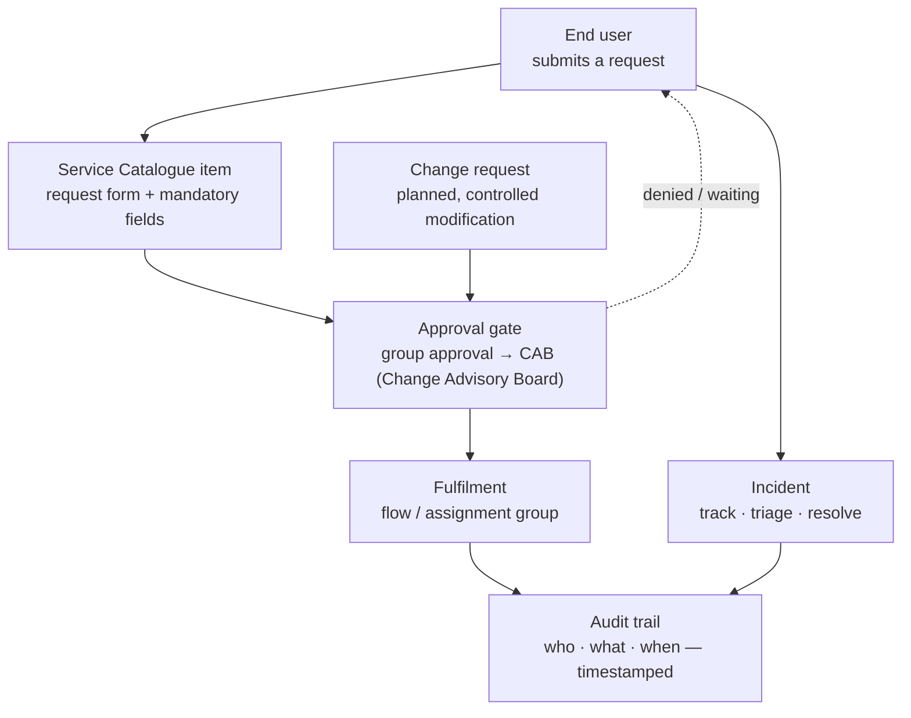

# Lab 4 — ServiceNow IT Service Management (ITSM)

## 🎥 Video walkthrough

▶️ **[Watch the walkthrough on Loom](https://www.loom.com/share/ae21f85af3d647b587410cc8e58fede7)** — a short walkthrough of the ServiceNow IT Service Management (ITSM) lab.

---

-1D9E75)

## Overview

In this lab I used **ServiceNow** — the enterprise **IT Service Management (ITSM)** platform — on a free **Personal Developer Instance (PDI)** to build and run the core workflows that turn every IT (Information Technology) request into a tracked, approved, auditable record. Working through four builds, I:

1. **Created, worked, and resolved an Incident** end to end — from triage through a documented resolution.
2. **Built a self-service Service Catalogue item** (a New Laptop Request) with a custom request form, mandatory fields, and a model-choice dropdown.
3. **Created and exercised an Approval Workflow** by routing a change request through a multi-tier approval chain and approving it.
4. **Built a Report** charting incident volume by priority over the last 30 days.

The goal wasn't just to click through a help-desk tool — it was to build the request-and-approval machinery that decides *who can get what, and whether they should*, which is the core of identity governance and the spine of an **Identity and Access Management (IAM)** engineer's work.

> **What this proves:** I can build a structured request workflow with required justification, route it through a layered approval gate, resolve and document it auditably, and report on it — the same request → approval → fulfilment → evidence chain that governs access in an enterprise.

---

## Why this matters

When users need something from IT (Information Technology) — a fix, a laptop, or *access to a system* — that request has to be tracked, routed, approved, fulfilled, and evidenced, consistently and auditably. Without a structured system, requests fall through the cracks and there's no record of who approved what. ServiceNow is how most enterprises solve this, and it's one of the most widely deployed platforms in the world, so hands-on experience is a concrete differentiator. For my target specifically, an access request is just one type of request on this same platform — so the skills here map directly onto identity governance.

| Role | How this lab applies |
|------|----------------------|
| IT Support / Help Desk | Creating and resolving incidents is the core daily task from day one |
| Sysadmin | Change management — logging, approving, and documenting infrastructure changes |
| IT Service Manager | Building service catalogues, defining approval workflows, reporting on volume and Service Level Agreement (SLA) compliance |
| IAM (Identity and Access Management) Engineer | A catalogue item + approval workflow *is* an access-request-and-approval pattern; the audit trail is the evidence access certification depends on |
| Cloud Engineer | Cloud operations teams run change requests, incidents, and service requests for cloud resources through ServiceNow |

---

## Architecture — how a request flows through ServiceNow

This diagram shows how a request moves through the platform from submission to a documented, auditable close. The key piece is the **approval gate** — the control point where an authorised approver decides whether the request should proceed *before* any fulfilment happens. That gate is the literal answer to the question "and should they?", which is why this "help-desk" platform is also an identity-governance platform.

---

## Setup & environment

Before the builds, here's the starting point so the lab can be followed from scratch:

- **Where it ran:** a free **ServiceNow Personal Developer Instance (PDI)**, requested at developer.servicenow.com — no credit card, no expiration. The instance provisions in about 10–15 minutes and is reached at a personal URL (format `dev#####.service-now.com`).
- **Release:** the current general-availability release (the **Australia** release, the family after Zurich). This is several versions newer than the "Washington" the official lab guide names, which is the source of most of the navigation differences noted below.
- **Keeping it alive:** a **Personal Developer Instance (PDI)** hibernates after 10 days of no use and is reclaimed after 30, so I log in at least weekly to keep the build.
- **Getting started:** logging in lands on the ServiceNow admin interface. Modules are reached from the **All** menu (top-left) by typing the module name into the filter — Incidents, Catalog Items, Change, and Reports are the ones this lab uses.

> All data shown is lab data on a personal developer instance. The users selected (e.g. Abel Tuter, Beth Anglin) are built-in sample records that ship with every **Personal Developer Instance (PDI)**.

---

## Key concepts (quick reference)

- **Incident** — an unplanned interruption to a service; the goal is to restore service fast. *(Identity angle: a lockout or "wrong access granted" is an access incident.)*
- **Problem** — the root cause behind one or more incidents; the goal is to eliminate it permanently, not patch each occurrence.
- **Change** — a planned, approved, scheduled modification to infrastructure or applications; the goal is minimal risk. *(Identity angle: changing what a Role-Based Access Control (RBAC) role grants is a change.)*
- **Service Request** — a user asking for something new they're entitled to (access, hardware, information); fulfilled from the **Service Catalogue**. *(Identity angle: "request access to an application" is a service request.)*
- **Service Level Agreement (SLA)** — the committed response/resolution time per priority. *(Identity angle: the leaver/deprovisioning Service Level Agreement (SLA) is the highest-stakes one — lingering access is a security exposure.)*
- **Approval workflow** — the control that requires sign-off before work proceeds; this is the "and should they?" gate that makes the platform a governance tool.

---

## Build 1 — Create, work, and resolve an Incident

**What I did:** created an incident for the scenario "user cannot access Outlook," set its priority via the Impact/Urgency matrix, assigned it, worked it with an internal work note, and resolved it with a documented resolution code and notes.

**What it shows:** the full incident lifecycle on one record — `INC0010002`, Caller Abel Tuter, **Priority 3 - Moderate**, Category Software, Assignment group Service Desk, ending in **State: Resolved** with a resolution code and notes. The priority wasn't typed directly — it calculated from **Impact = 2 - Medium** and **Urgency = 2 - Medium** through the priority matrix, which fits the scenario (one user affected, webmail workaround available).

**What I learned:** the work note (internal, **OWA (Outlook Web Access)** workaround, **ETA (Estimated Time of Arrival)** of 30 minutes) and the resolution notes (a corrupted **OST (Offline Storage Table)** file, fixed by rebuilding the profile) are what make the record auditable — the platform won't let an incident resolve without documenting *how* it was fixed. That required-evidence behaviour is the same discipline an access change needs.

**Troubleshooting note — Self Service view vs. agent view:** the new-incident form first opened in **Self Service** view — the simplified, end-user portal layout — which hides agent fields like Category, Impact, and Assignment group, so most of the lab's fields appeared "missing." They weren't missing; the view was wrong. The **Personalize Form** panel confirmed those fields weren't even available to add in that view. The fix was to open the incident through the agent route instead — **All → Incident → Create New** — which lands on the full **Default (agent) view** with every field present. *Recognising "Self Service portal experience" versus "agent platform experience" is a genuine ServiceNow distinction worth knowing.*

---

## Build 2 — Build a self-service Service Catalogue item

**What I did:** created a new catalogue item, **New Laptop Request**, in the Service Catalog, set its catalog/category/description, then added four request-form fields (called **Variables**) — including a dropdown built from custom choices.

**What it shows:** a working self-service request form. The four variables: **Requester Name** (mandatory), **Business Justification** (mandatory), **Required By Date** (mandatory), and **Laptop Model Preference** (a Select Box with choices Standard / Developer / Executive). Previewing the item with **Try It** renders the end-user order form with all four fields and the three mandatory ones flagged.

**What I learned:** this is the clearest identity parallel in the lab. A catalogue item is a *request form + fulfilment process* — structurally identical to an access-request item. Swap "laptop" for "application access" and the **Business Justification** field becomes the "why should they get this?" input an approver reviews. The instance even ships with real identity items (an "Access" item, and an "Add/Remove users from group" item) sitting right beside the hardware ones — concrete proof that requesting access and requesting a laptop are the same object type here.

**Troubleshooting note — the "Fulfillment group" field doesn't exist as a plain field:** the official lab guide says to set a **Fulfillment group**, but this release has no such field on the form. Fulfilment is configured on a **Process Engine** tab (via a Flow / Workflow / Execution Plan) instead — newer ServiceNow routes fulfilment through Flow Designer rather than a single hard-coded group. I left the Execution Plan at its default, because the build's objective is the item and its request form, not a fulfilment flow. *Knowing that fulfilment moved from a group field to a flow engine is the real takeaway, not the missing field.*

---

## Build 3 — Create and exercise an Approval Workflow

**What I did:** created a change request to deploy a security patch, advanced it through its lifecycle to trigger approval, and then approved it as the approver — watching the approval records move from Requested to Approved.

**What it shows:** the approval control working. The change (`CHG0030001`, "Deploy security patch MS24-001 to all Windows workstations," referencing **CVE-2024-0001** rated **CVSS 7.8**, deployed via **WSUS (Windows Server Update Services)**) reached a state banner reading **"Change is waiting for approval"** — the gate holding work until sign-off. The **Approvers** list then showed a multi-tier chain: a Change Management group approval, which on approval advanced the change to a second **CAB (Change Advisory Board)** approval stage. Approving cleared each tier, with the unused approvers correctly marked **No Longer Required**.

**What I learned:** this is identity governance in miniature. Work cannot proceed until the right people approve, and every decision is recorded with the approver's name and a timestamp — that's the audit evidence. The two-tier chain (group approval → **CAB (Change Advisory Board)** approval) maps directly onto how a sensitive access request often needs *manager* approval and then *data-owner* or *security* approval. Designing that layered "should they?" control is exactly what an **Identity and Access Management (IAM)** engineer does.

**Troubleshooting note — Normal change instead of Standard, and a required-field gate:** the lab guide calls for a **Standard** change, but this instance offered only **Emergency**, **Normal**, and pre-built **Preapproved** templates — no plain Standard type. I used **Normal**, which is actually the better choice here: Standard changes are pre-approved and *skip* the approval step, whereas a Normal change *requires* approval — which is the whole point of this build. Advancing the change also surfaced a second real-world control: the form made **Assignment group** mandatory before it would progress, blocking an unowned change from moving forward. *Both adaptations — picking the change type that actually demonstrates approval, and satisfying the required-field gate — are normal platform reality, not errors.*

---

## Build 4 — Build a Report

**What I did:** built a bar-chart report on the Incident table, grouped by priority, filtered to incidents created in the last 30 days.

**What it shows:** a report titled **Incident Volume by Priority - Last 30 Days**, on table **Incident [incident]**, **Group by = Priority**, **Aggregation = Count**, with the condition **Created · on · Last 30 days**. The chart renders bars per priority for recently created incidents (including the `INC0010002` ticket built in Build 1).

**What I learned:** metrics drive IT (Information Technology) operations decisions, and knowing how to define a report — table, grouping, aggregation, and a time filter — is expected at every level. A genuinely useful detail: nearly all the built-in sample incidents date from 2018–2022, so they fall *outside* the 30-day window and don't appear — the filter is doing its job, and a sparse chart is correct behaviour, not a broken report. The same grouping logic reports on access requests by status or approval time.

---

## Artifacts

The portfolio evidence for this lab is the screenshots above — a resolved incident with its work and resolution notes, the catalogue item's request form, the approval chain, and the report chart. Together they document the full request → approval → fulfilment → evidence cycle on a live instance.

---

## Summary — what this lab accomplished

Start to finish, I stood up a free ServiceNow developer instance and used it to build and run the core ITSM (IT Service Management) workflows across four scenarios:

| Build | What I demonstrated |
|-------|---------------------|
| Incident | Created, triaged, worked, and resolved an incident with documented work and resolution notes — the everyday support workflow, done auditably |
| Service Catalogue item | Built a self-service request form with mandatory justification and a model dropdown — structurally an access-request form |
| Approval Workflow | Routed a change through a two-tier group → CAB (Change Advisory Board) approval chain and approved it — the "and should they?" control, with full attribution |
| Report | Defined an incident-volume-by-priority bar chart over a 30-day window — the metrics side of IT operations |

**Skills demonstrated:** creating and resolving incidents with a calculated priority; building a service catalogue item with custom variables and choice lists; configuring and exercising a multi-tier approval workflow on a change request; building a grouped, filtered report; and adapting documented lab steps to a newer platform release (agent vs. Self Service views, the Process Engine replacing the fulfilment group, Normal vs. Standard change types).

**What I took away overall:**
- A catalogue item plus an approval workflow *is* an access-request-and-approval pattern — the same object an Identity and Access Management (IAM) team uses to govern access.
- The approval gate is the control that turns a help-desk platform into a governance platform: work waits until the right people sign off, with every decision timestamped and named.
- The platform refuses to resolve an incident or progress a change without documented evidence (resolution notes, an owning group) — the audit trail is built in, not bolted on.
- Real instances drift from the documentation; the durable skill is mapping the *intent* of a step onto whatever the current release actually offers.

---

## How this connects to my other work

This lab is the **governance and request layer** that sits on top of the identity work in my earlier labs. My [Active Directory lab](../active-directory/) built the system that answers "who can access what"; my [Splunk / SIEM lab](../splunk/) detected misuse of that access through login and group-change events. This lab builds the front half of the same story — *how access gets requested, approved, and recorded in the first place* — which is exactly where my IT General Controls (ITGC) auditing background fits: I used to test whether access was properly requested, approved, and evidenced, and here I build the workflow that produces that evidence. Together the labs span the identity lifecycle from request and approval (here) through enforcement (Active Directory) to detection (Splunk) — the request → approval → fulfilment → audit chain at the heart of **Identity and Access Management (IAM)**.
