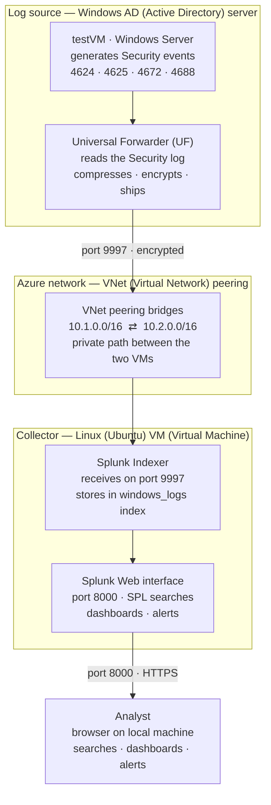

# Lab 3 — Splunk SIEM (Security Information and Event Management) & Log Analysis

> Building a working SIEM (Security Information and Event Management) platform that collects Windows security logs from an Active Directory (AD — Microsoft's directory of users, computers, and the rules governing who can access what) server and detects identity-based attacks: brute force, account lockouts, and suspicious logins.

---

## What this lab is, in one sentence

This lab forwards Windows login events from an Active Directory (AD) server into Splunk — a SIEM (Security Information and Event Management) platform — running on a separate Linux machine, then uses Splunk's search language to detect attacks against identities, the exact monitoring half of Identity and Access Management (IAM — the practice of controlling who has access to what).

---

## Why this matters (the business problem)

An organization generates millions of log events a day across servers, workstations, and cloud services. Without a SIEM (Security Information and Event Management), those logs sit isolated on each machine and nobody can search across them, correlate events, or spot an attack in progress. A SIEM solves this by collecting every machine's logs into one searchable place. When an alert fires, an analyst opens the SIEM and asks: what happened, when, from where, and what was affected.

For an Identity and Access Management (IAM) target role, this lab proves a specific skill: turning raw Active Directory (AD) login events into actionable detections — catching when an identity is being attacked or abused. That is the same instinct as the auditing question behind access reviews: *who has access, and should they?*

| Role | How this lab applies |
|---|---|
| Identity and Access Management (IAM) Engineer | Detecting brute force, privilege escalation, and rogue account creation against the directory |
| Security Operations Center (SOC) Analyst | Searching logs for suspicious activity, building dashboards and alerts |
| Cloud Security Engineer | Microsoft Sentinel and Amazon Web Services (AWS) Security Hub use the same SIEM mental model |

---

## Architecture

The diagram below shows the complete data flow built in this lab. A Windows Active Directory (AD) server generates security events; a Universal Forwarder (UF — a lightweight log-shipping agent) sends them across the Azure network to a Linux machine running Splunk; Splunk indexes the events and makes them searchable in a browser.



**Network security (NSG — Network Security Group, the per-VM firewall) rules used:**

| Port | Purpose | Source allowed |
|---|---|---|
| 22 | SSH (Secure Shell — encrypted remote terminal) | My own Internet Protocol (IP) address |
| 8000 | Splunk Web interface | My own Internet Protocol (IP) address |
| 9997 | Forwarder data input | VNet (Virtual Network) range only — not the public internet |

---

## Environment

| Component | Detail |
|---|---|
| Cloud | Microsoft Azure (Azure for Students) |
| Log source | Windows Server (Active Directory) — carried over from Lab 1 |
| Collector | Ubuntu 24.04 Linux VM (Virtual Machine), Standard_B2as_v2 (2 vCPU, 8GB RAM) |
| SIEM | Splunk Enterprise 10.4.0 (free licence, 500MB/day) |
| Forwarder | Splunk Universal Forwarder (Windows 64-bit) |
| Access | PuTTY (Secure Shell client) with key authentication; Remote Desktop Protocol (RDP) to the Windows server |

---

## What I built, start to finish

A reviewer can follow the whole build from this section.

**1. Stood up the Splunk collector.** Created an Ubuntu Linux VM (Virtual Machine) in Azure, connected to it over SSH (Secure Shell) using PuTTY with key-based authentication, downloaded Splunk Enterprise (the Linux `.deb` package), installed it, and started the service. Set an admin (administrator) account for the Splunk web interface.

**2. Configured Splunk to receive data.** In the Splunk web interface, enabled receiving on port 9997 (the standard port a forwarder ships logs to) and created a dedicated index named `windows_logs` — an index being Splunk's named storage bucket for a data source.

**3. Installed the Universal Forwarder on the Active Directory (AD) server.** On the Windows server, installed the Splunk Universal Forwarder (UF) and pointed it at the Splunk collector's private Internet Protocol (IP) address on port 9997.

**4. Told the forwarder which logs to collect.** Created an `inputs.conf` configuration file specifying the Windows Security, System, and Application event logs, with `evt_resolve_ad_obj = 1` so real usernames appear instead of internal identifier codes.

**5. Ran detection searches.** Using SPL (Search Processing Language — Splunk's own search language), built searches to detect failed logins, successful logins, account lockouts, and the highest-failure accounts.

**6. Built a security dashboard** with four visual panels and **created an automated alert** that fires when any account exceeds ten failed logins in the search window.

---

## Detections built (the SPL — Search Processing Language — searches)

Every search follows the same pattern: filter to the events, then pipe (`|` — feeds results into the next command) through commands that shape the output.

**Confirm data is flowing**
```spl
index=windows_logs | head 100
```

**Brute force — failed logins per account (the headline detection)**
```spl
index=windows_logs sourcetype=WinEventLog:Security EventCode=4625
| stats count by Account_Name
| sort -count
```
A pile of failed logons (Event Identifier 4625) on one account in a short window is the fingerprint of a brute force attack — an attacker guessing password after password. In this lab the `testVM` account showed 31 failures, standing out sharply from normal activity.


**Successful logins by type**
```spl
index=windows_logs sourcetype=WinEventLog:Security EventCode=4624
| stats count by Account_Name, Logon_Type
| sort -count
```
Logon Type 2 is interactive (at the keyboard), Type 3 is network, Type 10 is Remote Desktop Protocol (RDP), Type 5 is a service account.

**Event-code breakdown**
```spl
index=windows_logs
| stats count by EventCode
| sort -count
```

---

## Dashboard

A "Windows Security Overview" dashboard was built with four panels:

| Panel | Search | Visualization |
|---|---|---|
| Failed Logins | Event Identifier 4625 by account | Bar chart |
| Login Activity Over Time | Event Identifier 4624 over time | Line chart |
| Top Event Codes | All events by Event Identifier (EventCode) | Column chart |
| Failed vs Successful Logins | 4625 vs 4624 | Pie chart |


The Failed Logins panel makes the brute force pattern obvious — one account towering over the rest — and the Login Activity line shows the exact spike in time when the failed-login burst occurred, the kind of anomaly an analyst is trained to catch at a glance.

---

## Automated alert

An alert named **"Potential Brute Force — High Failure Count"** was created as a scheduled search:

- **Search:** counts failed logins per account, keeps only accounts with more than ten failures
- **Schedule:** runs every 15 minutes (cron expression `*/15 * * * *`)
- **Trigger:** fires when the number of results is greater than zero
- **Action:** adds to Splunk's Triggered Alerts list

This converts the dashboard from something an analyst must watch into automated detection that watches on its own — the way real Security Operations Center (SOC) detection works.


---

## Windows Event Identifiers (Event IDs) referenced

| Event Identifier | Meaning | Security relevance |
|---|---|---|
| 4624 | Successful logon | Baseline of normal access |
| 4625 | Failed logon | **Brute force indicator** when it spikes for one account |
| 4634 / 4647 | Logoff | Session ended |
| 4672 | Special privileges assigned at logon | An admin-level account logged on |
| 4688 | New process created | A program started — useful for spotting malicious execution |
| 4720 | A user account was created | Possible attacker backdoor account |
| 4740 | A user account was locked out | Often the fallout of a brute force attempt |

---

## Troubleshooting (real diagnostic work from this build)

These were not in the lab script — they were real failures diagnosed and fixed, and they are the most useful part of the lab.

**1. Cross-VNet (Virtual Network) routing — the forwarder could not reach Splunk.**
After installing the forwarder, no logs arrived. Running `Test-NetConnection 10.2.0.4 -Port 9997` on the Windows server returned `TcpTestSucceeded: False`, and the source address was `10.1.0.4` while the Splunk machine was `10.2.0.4`. The two virtual machines were in **separate Virtual Networks (VNets)** — `10.1.0.0/16` and `10.2.0.0/16` — with no path between them. The fix was to create a **VNet peering** linking the two networks, then update the port 9997 firewall (NSG — Network Security Group) rule to allow the source range. The connection test then returned `TcpTestSucceeded: True`. *Demonstrated skill: diagnosing a private-network routing problem from the connection test and source address, not guesswork.*

**2. The forwarder was connected but collecting nothing.**
Even with the network open and `list forward-server` showing `Active forwards: 10.2.0.4:9997`, the `windows_logs` index stayed empty. The forwarder log showed it connected but was not reading the Security event log. The `inputs.conf` placed in `etc\system\local` was not being read on this install. The fix was to add the input under the forwarder's own application folder (`etc\apps\SplunkUniversalForwarder\local\inputs.conf`), then fully stop and start the forwarder so it re-read the configuration. Events then flowed — 246 and climbing. *Demonstrated skill: isolating "connected but no data" to a configuration-load location rather than a network fault.*

**3. Splunk would not start as root.**
The first `splunk start` failed silently; the output warned that running Splunk Enterprise as root is deprecated. The fix was to start it with the `--run-as-root` flag. *Demonstrated skill: reading the startup output rather than assuming the install was broken.*

**4. Failed logins over Remote Desktop Protocol (RDP) did not log as Event Identifier 4625.**
Mistyping the password at the lock screen over an RDP session did not always produce 4625 events. The reliable fix was to generate failed logons directly with a PowerShell credential attempt, which produced clean 4625 events for the brute force detection.

---

## What I learned

- A SIEM (Security Information and Event Management) is a central log collector and search engine; the value is correlating events across machines that would mean nothing in isolation.
- The Universal Forwarder (UF) is how most enterprise environments feed logs into Splunk; getting data in is always the first real step.
- SPL (Search Processing Language) follows one pattern — filter, then pipe to a command — and that pattern covers most detection work.
- Identity attacks read as a sequence of Event Identifiers: many 4625 failures → a 4624 success → a 4672 privileged logon → 4688 process creation. Reading that sequence is the monitoring side of Identity and Access Management (IAM).
- Most of the real work was networking and configuration troubleshooting — which is exactly what the job is.

---

## Summary

| Item | Result |
|---|---|
| SIEM platform | Splunk Enterprise on Ubuntu Linux, web interface live on port 8000 |
| Log source | Windows Active Directory (AD) server via Universal Forwarder |
| Data path | Forwarder → port 9997 → Splunk, across a VNet (Virtual Network) peering |
| Detections | Brute force, successful logins, account lockouts, event-code breakdown |
| Dashboard | Four-panel Windows Security Overview |
| Alert | Automated brute-force alert, scheduled every 15 minutes |
| Hardest part | Diagnosing and fixing cross-VNet routing so the forwarder could reach Splunk |

---

*Part of [it-homelab](../) — hands-on IT and cloud security labs. Previous: [Lab 2 — Wireshark & Network Analysis](../wireshark). Built toward an Identity and Access Management (IAM) Engineer target.*
