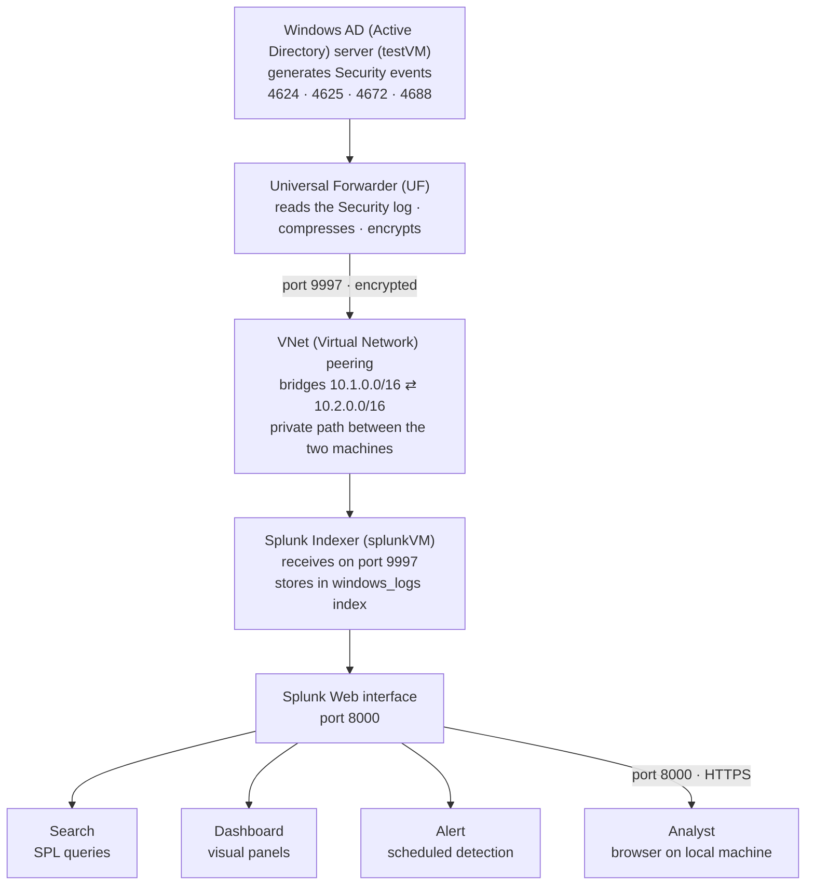

# Lab 3 — Splunk SIEM (Security Information and Event Management) & Log Analysis


-1D9E75)

A hands-on lab using **Splunk** (a SIEM — Security Information and Event Management — platform, the central tool a security team uses to collect and search logs) to detect identity-based attacks. I forwarded Windows security logs from my Active Directory (AD) server into Splunk, wrote SPL (Search Processing Language) searches to detect brute force, account lockouts, and suspicious logins, built a security dashboard, and created an automated alert. This is the monitoring half of Identity and Access Management (IAM — the practice of controlling who has access to what): not just granting access, but watching how it is used and catching when it is abused.

> **Environment:** log source is the Windows Active Directory (AD) server `testVM` (`lab.local` domain) from Lab 1; the SIEM is Splunk Enterprise 10.4.0 on an Ubuntu 24.04 Linux VM (Virtual Machine) named `splunkVM`. The two machines sit in separate Virtual Networks (VNets) — `10.1.0.0/16` and `10.2.0.0/16` — bridged by VNet peering. Azure region North Central US. All IP (Internet Protocol) addresses shown are private lab/cloud addresses.

---

## Why this matters

An organization generates millions of log events a day across servers, workstations, firewalls, and cloud services. Without a SIEM (Security Information and Event Management), those logs sit isolated on each machine and nobody can search across them, correlate events, or spot an attack in progress. A SIEM collects every machine's logs into one searchable place. When an alert fires, an analyst opens the SIEM and asks: what happened, when, from where, and what was affected. For identity work specifically, this is how a brute force attempt, a privilege escalation, or a rogue account gets caught — the same question behind every access review: *who has access, and should they?*

| Role | How this lab applies |
|------|----------------------|
| Identity and Access Management (IAM) Engineer | Detect brute force, privilege escalation, and rogue account creation against the directory |
| SOC (Security Operations Center) Analyst | Search logs for suspicious activity, build dashboards, and triage alerts |
| Incident Responder | Reconstruct an attack timeline from authentication events during an active incident |
| Cloud Security Engineer | The same SIEM mental model transfers directly to Microsoft Sentinel and Amazon Web Services (AWS) Security Hub |

---

## Architecture — how Splunk receives and processes logs

This diagram shows how data flows from the Windows Active Directory (AD) server, across the Azure network, and into Splunk for searching. The key piece is the **Universal Forwarder (UF)** — a lightweight agent installed on the log source whose only job is to read the Windows event logs and ship them to Splunk. Because the two machines live in separate Virtual Networks (VNets), a **VNet peering** bridges them so the forwarder can reach Splunk over the private Azure network rather than the public internet.



**Network security (NSG — Network Security Group, the per-machine firewall) rules:** port 22 for SSH (Secure Shell — encrypted remote terminal) and port 8000 for the web interface are open to my own IP (Internet Protocol) address only; port 9997 (forwarder data) is open to the VNet (Virtual Network) range only — never the public internet.

---

## Key concepts (quick reference)

- **SIEM (Security Information and Event Management)** — a platform that collects logs from across an environment and makes them searchable in one place, so one analyst can spot attacks across many machines at once.
- **SPL (Search Processing Language)** — Splunk's search language. It works as a pipeline: start with a search, then pipe (`|`) the results through commands that filter and shape them. Example: `index=windows_logs EventCode=4625 | stats count by Account_Name`.
- **Index** — Splunk's named storage bucket for a data source, like a database table. This lab uses one index called `windows_logs`; every search begins with `index=windows_logs`.
- **Universal Forwarder (UF)** — the lightweight agent installed on a log source that ships its logs to Splunk over port 9997.
- **Windows Event ID (Event Identifier)** — the number Windows stamps on each security event. The identity-critical ones: **4624** (successful logon), **4625** (failed logon), **4672** (admin-level logon), **4688** (process created), **4720** (account created), **4740** (account locked out).
- **Brute force** — an attacker trying password after password against one account until one works; it shows up as a spike of 4625 (failed logon) events on a single account.

---

## Step 1 — Stand up Splunk and get data flowing

**What I did:** created an Ubuntu Linux VM (Virtual Machine) in Azure, connected to it over SSH (Secure Shell) with PuTTY using key authentication, downloaded the Splunk Enterprise `.deb` (Debian/Ubuntu) package, installed it, and started the service. In the Splunk web interface I enabled receiving on port 9997 and created the `windows_logs` index. Then on the Windows Active Directory (AD) server I installed the Universal Forwarder (UF), pointed it at Splunk's private IP (Internet Protocol) address on port 9997, and created an `inputs.conf` file telling it to collect the Windows Security, System, and Application logs.

**What it shows:** a complete log pipeline — the Windows server generating events, the forwarder shipping them, and Splunk receiving and indexing them. Confirmed with `index=windows_logs | head 100`, which returned live Windows Security events (`sourcetype=WinEventLog:Security`, `host=testVM`).

**What I learned:** every Splunk deployment starts with getting data in, and the Universal Forwarder is how most enterprise environments feed logs to Splunk. Until data is actually arriving in the right index, nothing else in a SIEM works.

---

## Step 2 — Detect a brute force attack (Event ID 4625)

**What I did:** generated failed logins against the `testVM` account, then ran the core detection search:

```spl
index=windows_logs sourcetype=WinEventLog:Security EventCode=4625
| stats count by Account_Name
| sort -count
```

**What it shows:** the `testVM` account with **31 failed logins**, towering over normal activity. Reading the search left to right: `EventCode=4625` filters to failed logons only; `stats count by Account_Name` counts the failures per account; `sort -count` puts the highest first. A single account with dozens of failures in a short window is the fingerprint of a brute force attack.


**What I learned:** this one search is the difference between an analyst who finds threats and one who stares at dashboards. A spike of 4625 events on one account is brute force; the same failures spread across many accounts from one source would instead be a password spray. Recognizing which pattern is which is a frontline detection skill.

---

## Step 3 — Map successful logins and event types

**What I did:** ran searches for successful logons and for the overall mix of event types:

```spl
index=windows_logs sourcetype=WinEventLog:Security EventCode=4624
| stats count by Account_Name, Logon_Type
| sort -count
```

**What it shows:** successful logons grouped by account and Logon Type. Logon Type 2 is interactive (someone at the keyboard), Type 3 is network, Type 10 is RDP (Remote Desktop Protocol — controlling a machine remotely), Type 5 is a service account. A separate `stats count by EventCode` search revealed eight distinct event types in the data, dominated by 4688 (process creation).

**What I learned:** identity attacks read as a sequence of event IDs — many **4625** failures, then a **4624** success, then a **4672** admin-level logon, then **4688** a program runs. Reading that sequence is how an analyst reconstructs what an attacker did after getting in.

---

## Step 4 — Build a security dashboard

**What I did:** built a "Windows Security Overview" dashboard with four panels, each driven by an SPL (Search Processing Language) search:

| Panel | Search | Visualization |
|-------|--------|---------------|
| Failed Logins | Event ID 4625 by account | Bar chart |
| Login Activity Over Time | Event ID 4624 over time | Line chart |
| Top Event Codes | All events by Event ID (EventCode) | Column chart |
| Failed vs Successful Logins | 4625 vs 4624 | Pie chart |


**What it shows:** the security posture at a glance. The Failed Logins bar makes the brute force pattern obvious — one account dwarfing the rest — and the Login Activity line chart shows the exact spike in time when the failed-login burst occurred, the kind of anomaly an analyst is trained to catch instantly.

**What I learned:** dashboards give a permanent view of the environment without re-running searches by hand. Visualizing login failures over time and by user is exactly how a SOC (Security Operations Center) monitors authentication health.

---

## Step 5 — Create an automated alert

**What I did:** saved the brute force search as a scheduled alert named **"Potential Brute Force — High Failure Count"**:

```spl
index=windows_logs sourcetype=WinEventLog:Security EventCode=4625
| stats count as failures by Account_Name
| where failures > 10
```

- **Schedule:** runs every 15 minutes (cron expression `*/15 * * * *`)
- **Trigger:** fires when the number of results is greater than zero
- **Action:** adds to Splunk's Triggered Alerts list


**What it shows:** the `where failures > 10` line keeps only accounts above the threshold, so the alert fires when any account crosses ten failed logins. My `testVM` account with 31 failures trips it immediately.

**What I learned:** alerts turn monitoring into automated detection — Splunk runs the search on a schedule and notifies an analyst rather than waiting for a human to notice. Alert quality is the whole game: too broad and analysts tune it out, too narrow and it misses real attacks. Ten failures is a starting threshold to be tuned against real false-positive rates.

---

## Troubleshooting (real diagnostic work)

These were not in the lab script — they were real failures I diagnosed and fixed, and they are the most useful part of the lab.

- **Cross-VNet (Virtual Network) routing — the forwarder could not reach Splunk.** After installing the forwarder, no logs arrived. Running `Test-NetConnection 10.2.0.4 -Port 9997` on the Windows server returned `TcpTestSucceeded: False`, and the source address was `10.1.0.4` while Splunk was `10.2.0.4` — the two machines were in **separate Virtual Networks (VNets)** with no path between them. The fix was to create a **VNet peering** linking the networks, then update the port 9997 firewall (NSG — Network Security Group) rule to allow the source range. The connection test then returned `True`. *Demonstrated skill: diagnosing a private-network routing problem from the connection test and source address, not guesswork.*

- **The forwarder was connected but collecting nothing.** Even with the network open and `list forward-server` showing `Active forwards: 10.2.0.4:9997`, the index stayed empty. The `inputs.conf` in `etc\system\local` was not being read on this install. Moving the input into the forwarder's own application folder (`etc\apps\SplunkUniversalForwarder\local\inputs.conf`) and restarting fixed it — events then flowed. *Demonstrated skill: isolating "connected but no data" to a configuration-load location rather than a network fault.*

- **Splunk would not start as root.** The first `splunk start` failed silently; the output warned that running as root is deprecated. Starting with the `--run-as-root` flag resolved it. *Demonstrated skill: reading the startup output instead of assuming the install was broken.*

- **Failed logins over RDP (Remote Desktop Protocol) did not log as Event ID 4625.** Mistyping the password at the lock screen over an RDP session did not reliably produce 4625 events; generating failed logons directly with a PowerShell credential attempt produced clean events for the detection.

---

## Skills demonstrated

- Deploying Splunk Enterprise on Linux and installing the Universal Forwarder on a Windows server
- Configuring data inputs (`inputs.conf`) and a dedicated index
- Writing SPL (Search Processing Language) detections for failed logins, successful logins, lockouts, and account activity
- Reading Windows Event IDs and explaining the attack sequence they reveal
- Building a multi-panel security dashboard
- Creating a scheduled, automated detection alert
- Diagnosing and fixing cross-VNet (Virtual Network) routing and forwarder configuration faults

## What I learned (overall)

- A SIEM (Security Information and Event Management) is only as useful as the data it receives; getting data in is always the first real step.
- SPL (Search Processing Language) follows one pattern — filter, then pipe to a command — and that pattern covers most detection work.
- Identity attacks read as a sequence of Event IDs (4625 → 4624 → 4672 → 4688), and following that sequence is the monitoring side of Identity and Access Management (IAM).
- Most of the real effort was networking and configuration troubleshooting — which is exactly what the job is.

## How this connects

This builds directly on my [Active Directory lab](../active-directory/) — that lab covered **identity** (who can access what), and this one watches **how that access is actually used** and catches when it is attacked. The same `testVM` server that *was* the identity source in Lab 1 *generates the logs* analyzed here. It also pairs with my [Wireshark lab](../wireshark/): Wireshark reads traffic on the wire, Splunk reads events from the hosts — together they are the network and host halves of security monitoring. The detection mindset transfers directly to cloud SIEM tools like Microsoft Sentinel and Amazon Web Services (AWS) Security Hub.
