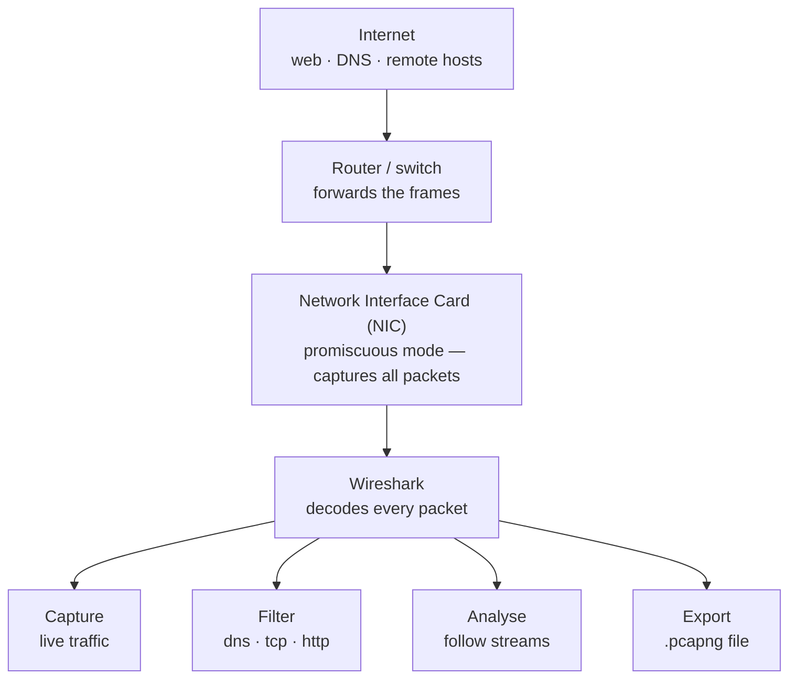

# Lab 2 — Wireshark & Network Analysis

-1D9E75)

A hands-on lab using **Wireshark** (a free, open-source network protocol analyzer) to capture live network traffic and analyze it packet by packet. I captured and dissected a DNS (Domain Name System) lookup, watched a TCP (Transmission Control Protocol) connection form through the three-way handshake, demonstrated why unencrypted HTTP (HyperText Transfer Protocol) is dangerous by capturing credentials in plaintext, and reassembled a full web conversation with Follow TCP Stream.

> **Environment:** captured inside a Windows Server VM (Virtual Machine) in Microsoft Azure (the `testVM` host from Lab 1). All traffic shown is lab traffic; the IP (Internet Protocol) addresses are private lab/cloud addresses.

---

## Why this matters

Networks carry every piece of data an organization produces — emails, logins, file transfers, database queries. When something breaks or a security alert fires, the only way to know what's *actually* happening is to look at the packets. Wireshark is the tool used to do exactly that: it captures the raw data crossing a network interface and lets you inspect it at every layer, from the raw frame up to the application data.

| Role | How this lab applies |
|------|----------------------|
| SOC (Security Operations Center) Analyst | Identify malicious traffic patterns and pull indicators of compromise from packet captures |
| Network Engineer | Diagnose connectivity issues by seeing exactly where packets are dropped or delayed |
| Incident Responder | Reconstruct what happened during a network event from the captured packets |
| Cloud Security Engineer | The packet-reading mental model transfers directly to Azure Network Watcher and VPC (Virtual Private Cloud) flow logs |

---

## Architecture — how Wireshark captures traffic
 
This diagram shows how data flows from the internet, through the network, and into Wireshark for analysis. The key piece is the **NIC (Network Interface Card) in promiscuous mode** — normally a NIC ignores packets not addressed to it, but promiscuous mode tells it to grab everything it sees, which is what hands Wireshark the raw traffic to decode.
 

 
---

## Key concepts (quick reference)

- **Packet** — a small unit of data crossing the network; has a header (source/destination IP addresses, port) and a payload (the data).
- **Protocol** — rules for how data is formatted and sent. DNS (name → IP address), HTTP (web content), TCP (reliable delivery), ICMP (Internet Control Message Protocol — ping/diagnostics).
- **TCP three-way handshake** — how two machines open a connection: **SYN** (Synchronize, "I want to connect") → **SYN-ACK** (Synchronize-Acknowledge, "got it, here's mine") → **ACK** (Acknowledge, "confirmed").
- **HTTP vs HTTPS** — HTTP is unencrypted (anyone can read it); HTTPS adds TLS (Transport Layer Security) encryption so captured packets are unreadable.
- **Display filter** — narrows the packet list to what you want to see (e.g. `dns`, `tcp`, `http.request.method == POST`) without discarding the rest of the capture.

---

## Exercise A — Capture and analyze a DNS (Domain Name System) lookup

**What I did:** started a capture, ran `nslookup google.com` in a terminal to trigger a DNS query, then filtered the capture with `dns` to isolate it.

**What it shows:** the DNS query asking "what is the IP address for google.com?" and the response carrying the answer. Expanding the response packet's detail pane shows the **A (Address) record**: `google.com: type A, class IN, addr 142.251.211.46` — and it matches exactly what the `nslookup` terminal returned, confirming the lookup. The capture also caught the **AAAA record** (the IPv6, Internet Protocol version 6, address `2607:f8b0:4009:815::200e`).

**What I learned:** this invisible lookup happens before every website visit, app connection, and email. In the real world, **unexpected DNS queries to unusual domains** are often the first sign of malware "calling home" to a command-and-control server (the attacker's machine that controls infected systems). DNS visibility is a frontline detection skill.

---

## Exercise B — Watch the TCP (Transmission Control Protocol) three-way handshake

**What I did:** captured traffic while connecting to a web server, then filtered to that server's IP address (`tcp and ip.addr == 54.82.22.214`) to isolate the connection setup.

**What it shows:** the three packets that open every TCP connection, in order:
- **SYN** (Synchronize) — my machine → server: "I want to connect."
- **SYN, ACK** (Synchronize-Acknowledge) — server → my machine: "Got it, here's mine, connection accepted."
- **ACK** (Acknowledge) — my machine → server: "Confirmed, ready to send data."

**What I learned:** this is the single most useful pattern for diagnosing connectivity. Three packets in sequence = the connection succeeded. A **SYN with no SYN-ACK** coming back = the connection was refused or the server is unreachable. An **RST (Reset)** packet = the connection was forcibly closed. Recognizing these instantly tells you whether a connection problem is happening and where.

---

## Exercise C — Spot cleartext credentials over HTTP (HyperText Transfer Protocol)

> **Ethics note:** performed only against **ZeroBank** (`zero.webappsecurity.com`), a deliberately vulnerable site built specifically for security training. Never capture credentials on systems you don't own or have permission to test.

**What I did:** logged into the HTTP (unencrypted) ZeroBank test site with test credentials, captured the traffic, and filtered with `http.request.method == POST` to find the login submission. The browser flagged the site as **"Not secure"** because it uses HTTP, not HTTPS.

**What it shows:** the POST request that submitted the login form. Expanding the **HTML (HyperText Markup Language) Form URL Encoded** layer reveals the submitted form fields in **plaintext**:
- `user_login = "derpderpson"`
- `user_password = "derpderpson"`

**What I learned:** without TLS (Transport Layer Security) encryption, anyone on the network path — an ISP (Internet Service Provider), a coffee-shop router, or a man-in-the-middle attacker (someone secretly intercepting traffic between you and the server) — can read credentials exactly as typed. This is the concrete, hands-on reason **HTTPS is mandatory** for any site handling sensitive data, and it's how security teams prove the risk to developers.

---

## Exercise D — Follow a full TCP (Transmission Control Protocol) stream

**What I did:** right-clicked a packet → **Follow → TCP Stream**, which reassembles all the individual packets of one connection into a single readable conversation. The window title (`Follow TCP Stream (tcp.stream eq 1)`) confirms it's the stream-follow view.

**What it shows:** a complete request-and-response conversation reassembled from many individual packets — the request in **red**, the server's response in **blue**. In this capture, the stream is the Azure VM's internal communication with the Azure platform: the **Windows Azure Agent** (`WaAgent`, the software inside every Azure VM) sending `GET /machine?comp=goalstate` to Azure's internal wire-server address (`168.63.129.16`), and the platform responding `HTTP/1.1 200 OK` with the VM's **GoalState** — an XML document describing the VM's expected state, configuration, and role instance (it even names `_testVM`).

**What I learned:** individual packets are just fragments — the stream view reassembles the whole exchange so you can read what was requested and what came back. This particular stream was a useful surprise: it's the behind-the-scenes "heartbeat" between an Azure VM and Azure's control plane, not ordinary web browsing. Being able to capture a conversation and recognize *what* it is — agent-to-platform management traffic versus a normal web request — is exactly the kind of traffic identification an incident responder does when reconstructing what happened on a host.

---

## Captures

I saved the packet captures from these exercises as `.pcapng` (Packet Capture Next Generation) files — the format Wireshark records to — for my own reference. They aren't published here, since the screenshots above already show the relevant findings and raw captures can contain incidental background traffic.

---

## Skills demonstrated

- Capturing live network traffic with Wireshark
- Applying display filters (`dns`, `tcp`, `ip.addr ==`, `http.request.method == POST`) to find specific traffic in thousands of packets
- Reading and explaining the TCP three-way handshake
- Identifying DNS queries and responses and matching them to a record
- Demonstrating the security risk of unencrypted HTTP by capturing plaintext credentials
- Reassembling a full conversation with Follow TCP Stream

## What I learned (overall)

- The volume of a live capture is overwhelming by design — the real skill is using display filters to narrow thousands of packets down to the few that matter in seconds.
- The TCP handshake is the fastest way to tell whether a connection succeeded or failed.
- Seeing a password travel in plaintext made the importance of HTTPS/TLS concrete in a way no diagram could.
- DNS is involved in nearly every network action, which makes DNS monitoring a core security detection point.

## How this connects

This pairs with my [Active Directory lab](../active-directory/) — that lab covered **identity** (who can access what), and this one covers **the network** (what's actually moving on the wire). Together they're the two core lenses a security analyst works across. Notably, **DNS appears in both**: in the AD lab the domain controller ran DNS so the client could find the domain; here I captured DNS queries on the wire. The packet-analysis mindset also transfers directly to cloud network monitoring like Azure Network Watcher and VPC flow logs.
